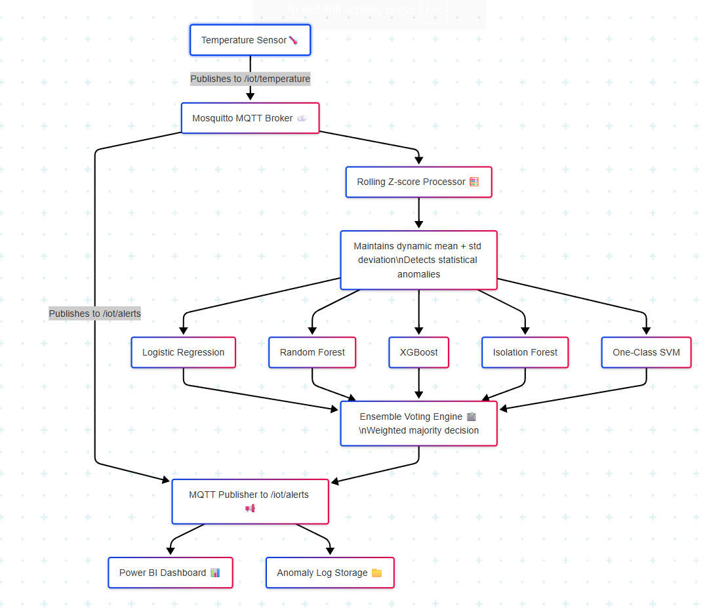
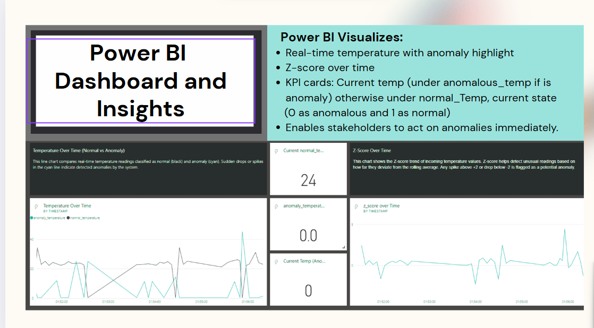

# Real-Time IoT Anomaly Detection Pipeline

## 📘 Overview
This repository contains the implementation of a **real-time anomaly detection pipeline** designed to identify unusual patterns in temperature sensor data. The system integrates IoT, machine learning, and reinforcement learning to enable **predictive maintenance** and **live anomaly monitoring** through MQTT-based streaming and Power BI dashboards.

The solution combines hardware data acquisition, ensemble ML modeling, and adaptive learning — resulting in a fast, scalable, and intelligent detection framework for IoT environments.

---

## 🧠 Project Workflow
The system operates in a continuous loop:
[Sensors] → [Microcontroller (Arduino)] → [MQTT Broker] → [Python Listener] → [ML Ensemble + RL Agent] → [Power BI Visualization]

---

## ⚙️ Components

### **1. Temp.ino**
Arduino code responsible for:
- Reading data from **DHT** temperature sensors.  
- Publishing live readings to an MQTT topic (`home/temperature`).  
- Simulating a real-world IoT setup by streaming continuous data to the broker.

---

### **2. Training-Final.ipynb**
- Handles **data preprocessing**, **feature scaling**, and **model training**.
- Trains five ML algorithms for anomaly detection:
  - Logistic Regression  
  - Random Forest  
  - XGBoost  
  - Isolation Forest  
  - One-Class SVM  
- Each model is stored as a `.pkl` file in the repository for reuse.

Output models:
logistic_regression_model.pkl
random_forest_model.pkl
xgboost_model.pkl
isolation_forest_model.pkl
one_class_svm_model.pkl
scaler.pkl

---

### **3. Listen.ipynb**
The live data listener and decision engine.  
- Subscribes to MQTT topic `home/temperature`.  
- Passes incoming temperature values through the **trained ensemble models**.  
- Performs **Z-score** and **majority-vote** validation.  
- Invokes the **Multi-Anomaly Adaptive Agent** for reinforcement learning-based tuning.  
- Pushes final results to **Power BI REST API** for visualization.  
- Logs outcomes locally for analysis and model improvement.

---

## 🧩 System Architecture

---

## 📊 Visualization
The Power BI dashboard provides:
- Real-time anomaly vs normal temperature tracking  
- Z-score trend lines  
- Historical anomaly frequency plots  

---

## 🛠️ Tech Stack

**Languages & Frameworks**
- Python  
- C++ (Arduino)  

**Libraries**
- scikit-learn, XGBoost, NumPy, Pandas, Paho-MQTT, Joblib, Requests  

**IoT & Cloud**
- MQTT (Mosquitto Broker)  
- Power BI REST API  

**Hardware**
- Arduino / ESP32  
- DHT22, MAX30205, MAX30102 sensors  

---

## 📂 Repository Structure
📦 anomaly-detection-pipeline
┣ 📜 Listen.ipynb # Real-time MQTT listener & anomaly detection
┣ 📜 Training-Final.ipynb # Model training & saving pipeline
┣ 📜 Temp.ino # Arduino code for temperature publishing
┣ 📜 README.md # Project documentation
┣ 📜 Structure.png # System architecture diagram
┣ 📜 Visualization.png # Power BI dashboard visualization
┣ 📜 logistic_regression_model.pkl # Trained Logistic Regression model
┣ 📜 random_forest_model.pkl # Trained Random Forest model
┣ 📜 xgboost_model.pkl # Trained XGBoost model
┣ 📜 isolation_forest_model.pkl # Trained Isolation Forest model
┣ 📜 one_class_svm_model.pkl # Trained One-Class SVM model
┗ 📜 scaler.pkl # Feature scaling transformer

---

## 🚀 Results & Achievements
- Achieved **~97% accuracy** on anomaly classification.  
- Enabled **real-time detection and visualization** with latency under 3 seconds.  
- Successfully integrated **five ML models and an RL agent** for robust adaptive learning.  
- Demonstrated predictive maintenance capabilities using **live IoT data streams**.  

---

## 💡 Future Improvements
- Extend the pipeline to multi-sensor data (humidity, vibration, and air quality).  
- Migrate MQTT broker to Azure IoT Hub for large-scale deployment.  
- Add automated alerting (email/SMS) and persistent storage (PostgreSQL).  
- Deploy a web dashboard for live data analysis.

---

## 👨‍💻 Author
**Ishaan Gupta**  
Bachelor of Software Engineering (Honours) — Deakin University  
Specialization: Artificial Intelligence  
📍 Melbourne, Australia  
📧 [ishaang714@gmail.com](mailto:ishaang714@gmail.com)  
🔗 [LinkedIn](https://www.linkedin.com/in/ishaan-gupta-23ig/)  

---

⭐ *If you found this repository useful or interesting, consider starring it!*
